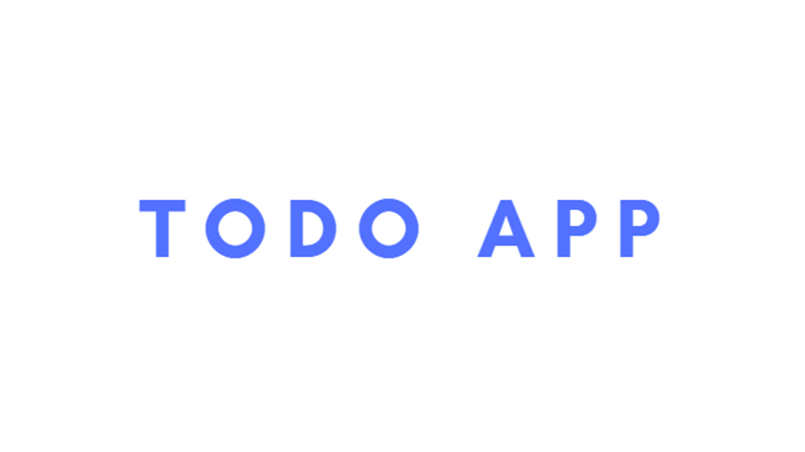
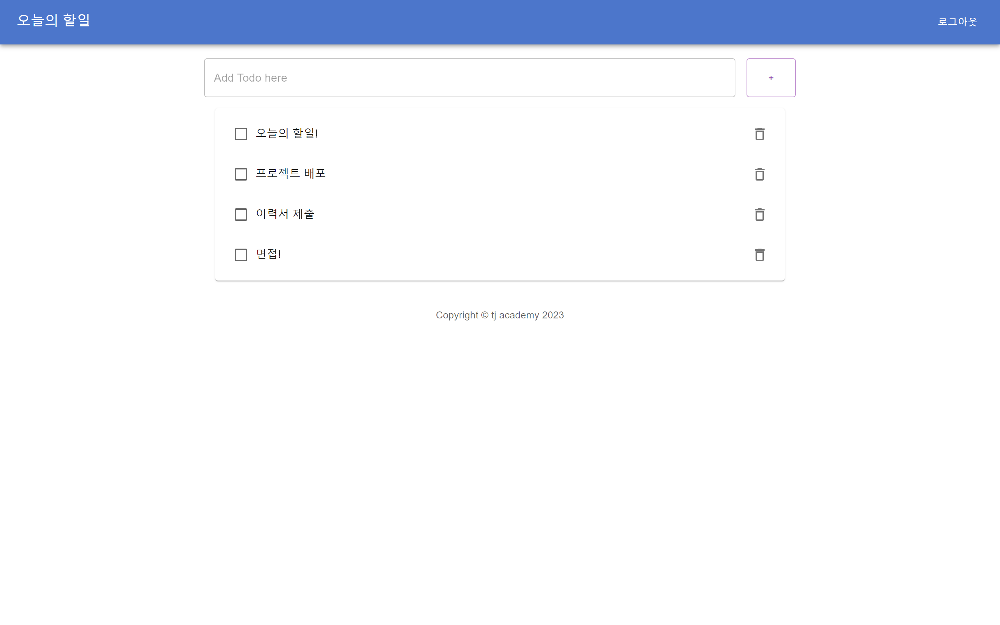

<!-- Improved compatibility of back to top link: See: https://github.com/othneildrew/Best-README-Template/pull/73 -->
<a name="readme-top"></a>
<!--
*** Thanks for checking out the Best-README-Template. If you have a suggestion
*** that would make this better, please fork the repo and create a pull request
*** or simply open an issue with the tag "enhancement".
*** Don't forget to give the project a star!
*** Thanks again! Now go create something AMAZING! :D
-->


<!-- PROJECT SHIELDS -->
<!--
*** I'm using markdown "reference style" links for readability.
*** Reference links are enclosed in brackets [ ] instead of parentheses ( ).
*** See the bottom of this document for the declaration of the reference variables
*** for contributors-url, forks-url, etc. This is an optional, concise syntax you may use.
*** https://www.markdownguide.org/basic-syntax/#reference-style-links
-->

<!-- PROJECT LOGO -->
<br />
<div align="center">
  <a href="https://pf3.chanyongyang.com/" target="_blank">
    
  </a>

<h3 align="center">Todo App</h3>

  <p align="center">
    React + Spring Boot를 활용한 Todo App 구현 
    <br>
    <p>작업기간 : 2023.05.15~2023.05.24</p>
  </p>

[//]: # (  <a href="https://pf3.chanyongyang.com/" target="_blank">View Demo</a>)
</div>


<!-- TABLE OF CONTENTS -->
<details>
  <summary>Table of Contents</summary>
  <ol>
    <li>
      <a href="#about-the-project">About The Project</a>
      <ul>
        <li><a href="#built-with">Built With</a></li>
      </ul>
    </li>
    <li>
      <a href="#getting-started">Getting Started</a>
      <ul>
        <li><a href="#사전준비">사전준비</a></li>
	<li><a href="#저장소 복제">저장소 복제</a></li>
        <li><a href="#데이터베이스 구성">데이터베이스 구성</a></li>
	<li><a href="#데이터베이스 테이블 생성 쿼리">데이터베이스 테이블 생성 쿼리</a></li>
	<li><a href="#데이터베이스 연결">데이터베이스 연결</a></li>
	<li><a href="#Oauth 설정">Oauth 설정</a></li>
	<li><a href="#설치">설치</a></li>
      </ul>
    </li>
    <li>
	<a href="#사용방법 및 기능소개">사용방법 및 기능소개</a>
	  <ul>
   		<li><a href="#실행">실행</a></li>
   		<li><a href="#기능소개">기능소개</a></li>
		<li><a href="#사용방법">사용방법</a></li>
	  </ul>
    </li>
    <li><a href="#요구사항">요구사항</a></li>
    <li>
        <a href="#Collaborator">Collaborator</a>
        <ul>
            <li><a href="#프로젝트 후기">프로젝트 후기</a></li>
        </ul>
    </li>   
    <li><a href="#Contact">Contact</a></li>
    <li>
	    <a href="#Acknowledgments">Acknowledgments</a>
	    <ul>
		    <li><a href="#References">References</a></li>
	    </ul>
    </li>
  </ol>
</details>


<!-- ABOUT THE PROJECT -->
## About The Project



<br>
React.JS + Spring Boot를 활용한 SPA, REST API 기반 웹 애플리케이션 개발 <br>
React.JS, 스프링 부트, AWS로 배우는 웹 개발 101 책을 참고하여 작업 <br>


### Built With
<br>


<br>

<br>


<br>


<p align="right">(<a href="#readme-top">back to top</a>)</p>


<!-- GETTING STARTED -->
## Getting Started

프로젝트를 복제하여 로컬에서 설정하는 방법에 대한 설명 입니다. <br>

### 사전준비

#### 저장소 복제
   ```sh
   git clone https://github.com/yangchanyong/AWS_fullstack_semi_project.git
   ```
  ```sh
   git clone https://github.com/yangchanyong/hello.git
   ```

#### 데이터베이스 구성

  

#### 데이터베이스 테이블 생성 쿼리

  <details>
    <summary>query</summary>

    CREATE TABLE `user` (
      `id` varchar(750) NOT NULL,
      `username` varchar(750) NOT NULL,
      `password` varchar(500) DEFAULT NULL,
      `role` varchar(500) DEFAULT NULL,
      `auth_provider` varchar(500) DEFAULT NULL,
      PRIMARY KEY (`id`)
    )
    CREATE TABLE `todo` (
      `id` varchar(750) NOT NULL,
      `user_id` varchar(750) DEFAULT NULL,
      `title` text DEFAULT NULL,
      `done` char(1) DEFAULT NULL,
      PRIMARY KEY (`id`)
    );

  </details>


#### 데이터베이스 연결 <br>
hello Project <br>
root/src/main/com/chanyongyang/hello/resources/application-datasource.yml 생성
<br>

  ```sh
  spring:
    datasource:
      driver-class-name: org.mariadb.jdbc.Driver
      username: 'username'
      password: 'password'
      url: jdbc:mariadb://'DB url':'port'/'DB name'
  ```

#### Oauth 설정
GitHub, google 시크릿키 발급 후 <br>
root/src/main/com/chanyongyang/hello/resources/application-oauth2.yml 생성

  ```sh
  spring:
    security:
      oauth2:
        client:
          registration:
            github:
              client-id: 'id'
              client-secret: 'GitHub secret key'
              redirect-uri: "{baseUrl}/oauth2/callback/{registrationId}"
              scope:
                - user:email
                - read:user
  
            google:
              client-id: 'Google id'
              client-secret: 'Google secret key'
              redirect-uri: "{baseUrl}/oauth2/callback/{registrationId}"
              scope:
                - email
                - profile
  
          provider:
            github:
              authorization-uri: https://github.com/login/oauth/authorize
              token-uri: https://github.com/login/oauth/access_token
              user-info-uri: https://api.github.com/user
```

### 설치

#### react
1. yarn
2. React.js
3. material MUI
4. react-router

#### Spring Boot
1. JDK 1.8


#### ETC
1. MariaDB
2. Lombok
3. Tomcat9

<p align="right">(<a href="#readme-top">back to top</a>)</p>


<!-- USAGE EXAMPLES -->
## 사용방법

#### 실행
1. Spring Boot 프로젝트 실행
```agsl
root/src/main/java/com/chanyongyang/hello/HelloApplication.java 실행
```

2. React 프로젝트 실행
 - 터미널 실행
```agsl
yarn start
```
  
url : localhost:3000

#### 기능소개
<pre>
1. 회원
  1-1. 일반 회원가입
  1-2. Oauth 로그인
  1-3. 로그인

2. todo
  2-1. 할일 추가
  2-2. 할일 수정
  2-3. 할일 삭제
  2-4. 할일 일괄삭제
</pre>

#### 사용방법
<pre>
로그인 후 일정 추가, 수정, 삭제
</pre>


<p align="right">(<a href="#readme-top">back to top</a>)</p>


<!-- ROADMAP -->
## 요구사항

### 작업목록
- [x] 작업완료
- [ ] 작업예정

#### 회원
- [x] 회원가입
- [x] 로그인
- [x] Google Oauth2 로그인
- [x] GitHub Oauth2 로그인
- [ ] Naver Oauth2 로그인
- [ ] Kakao Oauth2 로그인
- [x] 일정 추가
- [x] 일정 수정
- [x] 일정 삭제
- [x] 일정 일괄삭제

<p align="right">(<a href="#readme-top">back to top</a>)</p>

## Collaborator
Personal Project

<p align="right">(<a href="#readme-top">back to top</a>)</p>


<!-- LICENSE -->

### 프로젝트 후기
<pre>
Spring Boot와 React.JS을 입문하기 위해서 프로젝트를 진행하였습니다.
<b>React.js, 스프링부트, AWS로 배우는 웹개발 101</b> 책을 참고하고 진행하였으며
SPA에 대한 이해, React.JS의 새로움, Security의 중요성을 느꼈습니다.
프로젝트를 진행하며, React에 대한 이해도가 낮아 많이 어려웠지만
책을보고, 구글링을 하여 문제사항들을 해결해 나갔습니다.
자신감은 많이 늘었지만, 자만 하지 않고 더 열심히 정진해야겠습니다.
</pre>


<p align="right">(<a href="#readme-top">back to top</a>)</p>


<!-- CONTACT -->
## Contact

Yang Chanyong - cksdyd93@gmail.com

<a href="https://pf3.chanyongyang.com" target="_blank">Demo Link</a>

<a href="https://www.chanyongyang.com" target="_blank">Portfolio Link</a>

<p align="right">(<a href="#readme-top">back to top</a>)</p>


<!-- ACKNOWLEDGMENTS -->
## Acknowledgments

이 프로젝트를 사용해주시고 README를 읽어주신 여러분께 대단히 감사합니다!

### References
README Template : [README-Template](https://github.com/othneildrew/Best-README-Template)<br>
Reference : [React.js, 스프링부트, AWS로 배우는 웹개발 101](https://www.aladin.co.kr/shop/wproduct.aspx?ItemId=301538431&start=slayer)<br>


<p align="right">(<a href="#readme-top">back to top</a>)</p>

[](https://hits.seeyoufarm.com)

